# TJU-SE-OS-Assignments
同济大学软件学院操作系统课程作业（2025春季）   Operating System course assignments at Tongji University   `Assignment1-进程调度` `Assignment2-内存管理` `Assignment3-文件系统`  

##  Assignment2

### 📌 一、项目背景与目的

操作系统中的内存管理是保障多任务并发执行的重要机制，尤其是分页存储管理和页面置换算法对系统性能有直接影响。本项目通过 C# 语言与 WPF 界面，模拟分页式存储管理中的**内存分配**、**缺页中断**、**页面置换**等机制，帮助理解内存管理过程和页面置换策略（如LRU算法）的实际应用效果。

------

### 📌 二、系统功能概述

本系统实现了以下核心功能：

- 支持**分页存储管理**，模拟程序执行过程中的内存页调度；
- 支持**缺页中断处理**和**页面置换机制**；
- 实现**FIFO (First-In First-Out)** 和 **LRU (Least Recently Used)**两种**页面置换算法**；
- 提供**单步执行**指令和**连续执行**指令、查看物理内存状态和命中/缺页情况；
- 支持**随机执行地址**和**顺序执行地址**两种指令流；
- 完成**运行统计**，如缺页次数。
- 可自行设置参数，调整**内存页数目**，**每页内存大小**,**作业（程序）大小**,**所选页面置换算法**,**指令执行顺序模式**等,
  通过自定义参数，用户可以灵活配置内存调度环境，开展不同条件下的模拟与分析实验。

------

### 📌 三、原理介绍

#### 3.1  分页式存储管理简介

在现代操作系统中，**分页式存储管理**（Paging Storage Management）是一种将进程逻辑地址空间划分为若干**固定大小的页**（Page）并映射到物理内存中对应**固定大小的页框**（Frame）中的内存管理方式。通过分页，操作系统能够实现**离散分配、虚拟内存扩展**以及**减少内存碎片**等功能，有效提升内存利用率和系统多任务调度能力。

####  3.2 缺页中断与页面置换

由于物理内存空间有限，当进程运行过程中访问的某个页面尚未被调入内存，便会产生**缺页中断**（Page Fault）。操作系统捕获缺页中断后，需将缺失页面从磁盘（或外存）调入内存，若内存已满，则必须选择某个现有页面将其置换出去，以为新页面腾出空间，这一过程即为**页面置换（Page Replacement）**。

为提升系统性能，合理选择置换的页面至关重要，因此提出了多种**页面置换算法**。

#### 3.3 常见页面置换算法

- **FIFO (First-In First-Out) 页面置换算法**
  最简单的页面置换策略。将内存页视作一个队列，每次调入新页面时，直接将最早进入内存的页面置换出去。该算法实现简单，但可能导致**异常现象（Belady现象）**，即增加内存页数反而导致缺页率上升。
- **LRU (Least Recently Used) 页面置换算法**
  基于程序的**局部性原理**，认为最近使用过的页面在未来仍可能被访问，而很久未被访问的页面不太可能继续使用。LRU算法记录每个页面上次被访问的时间，每次发生缺页中断时，选择**最近最久未被访问的页面**进行置换。
  LRU算法缺点是需要额外的数据结构（如栈、链表或访问时间记录）来维护页面访问顺序，开销相对较大，但整体性能优于FIFO，尤其适用于实际程序存在较强局部性的场景。

#### 3.4 本项目中的应用

本系统模拟分页存储管理机制，支持**缺页中断检测与页面置换机制**，并分别实现了**FIFO**和**LRU**两种经典页面置换算法，便于用户观察不同算法在不同内存分配条件下的执行效果与缺页率对比，进一步理解**内存管理策略对程序运行性能的影响**。

### 📌 四、算法设计

#### 4.1 FIFO (First-In First-Out) 页面置换算法

**FIFO 页面置换算法**是一种最简单、直观的页面置换方法。该算法将所有调入内存的页面按照**进入内存的先后顺序**排列成一个队列，每次发生缺页中断且内存已满时，优先置换队列头部（即**最先进入内存**的页面）。

##### 📖 算法原理：

- 系统维护一个**先进先出队列**，用于记录当前在内存中的页面号。
- 每当有新页面调入内存：
  - 如果该页面已存在于队列中，表示命中，直接返回；
  - 如果不存在：
    - 若内存未满，将新页面加入队尾；
    - 若内存已满，执行**置换操作**，将队头的页面移除，腾出空间后再将新页面加入队尾。
- 每次置换页面时，移除的是**驻留内存时间最久**且**未被再次访问**的页面。

##### 📖 算法实现：

项目中通过 `FIFOReplacer` 类实现该算法。其核心实现方法如下：

- `Queue<int> _queue`
  用于维护内存中页面的先进先出顺序。
- `AccessPage(int page)`
  判断页面是否在队列中，若不在则加入队尾，返回缺页（false）；若存在，命中（true）。
- `GetVictimPage()`
  执行置换操作，返回队头页面作为被置换页面，并将其从队列中移除。
- `ContainPage(int page)`
  判断指定页面是否存在于当前内存队列中。
- `PrintQueueElements(Action<string> logCallback)`
  用于将当前队列状态输出，便于调试和日志记录。

##### 📖 示例说明：

例如，页面访问顺序为：3 → 2 → 1 → 4 → 5，内存容量为3。

执行过程如下：

| 当前队列          | 访问页面 | 是否缺页 | 置换页面 |
| ----------------- | -------- | -------- | -------- |
| 空 → [3]          | 3        | 缺页     | 无       |
| [3] → [3,2]       | 2        | 缺页     | 无       |
| [3,2] → [3,2,1]   | 1        | 缺页     | 无       |
| [3,2,1] → [2,1,4] | 4        | 缺页     | 3        |
| [2,1,4] → [1,4,5] | 5        | 缺页     | 2        |

##### 📖 特点分析：

- **优点**：实现简单，时间复杂度低，易于管理。
- **缺点**：不考虑页面的访问频率和时间局部性，可能导致**Belady异常现象**。

#### 4.2 LRU (Least Recently Used) 页面置换算法

**LRU 页面置换算法**是一种基于**最近最少使用原则**的页面置换策略。该算法认为：**在未来较长时间内不太可能被访问的页面，是最近一段时间最少使用的页面**。因此，当发生缺页中断且内存已满时，选择**距离当前时间最久未被访问的页面**予以置换。

##### 📖 算法原理：

- 系统维护一个**按页面访问顺序排列的链表**，每当页面被访问：
  - 若该页面已在内存中，将其移至链表尾部，表示“最近使用”。
  - 若不在内存中：
    - 若内存未满，直接将新页面加入链表尾部；
    - 若内存已满，移除链表头部页面（最近最少使用），再将新页面加入链表尾部。

##### 📖 算法实现：

项目中通过 `LRUReplacer` 类实现该算法。其核心实现方法如下：

- `LinkedList<int> _accessOrder`
  链表用于维护页面访问顺序，链表尾部是最近访问，头部是最久未访问。
- `Dictionary<int, LinkedListNode<int>> _pageMap`
  哈希表用于快速查找页面是否存在于链表中，并定位其对应结点，避免链表的遍历操作。
- `AccessPage(int page)`
  判断页面是否在链表中：
  - 若存在，将其移到链表尾部，返回命中（true）；
  - 若不存在，创建新结点加入链表尾部，返回缺页（false）。
- `GetVictimPage()`
  移除链表头部页面（最近最少使用），并返回该页面号。
- `ContainPage(int page)`
  判断指定页面是否存在于当前内存链表中。
- `PrintQueueElements(Action<string> logCallback)`
  将当前链表中的页面访问顺序输出，便于调试和日志查看。

##### 📖 示例说明：

例如，页面访问顺序为：1 → 2 → 3 → 2 → 4→ 1 → 5，内存容量为3。

执行过程如下：

| 当前链表          | 访问页面 | 是否缺页 | 置换页面 |
| ----------------- | -------- | -------- | -------- |
| 空 → [1]          | 1        | 缺页     | 无       |
| [1] → [1,2]       | 2        | 缺页     | 无       |
| [1,2] → [1,2,3]   | 3        | 缺页     | 无       |
| [1,2,3] → [2,3,1] | 2        | 命中     | 无       |
| [2,3,1] → [3,1,4] | 4        | 缺页     | 2        |
| [3,1,4] → [1,4,3] | 1        | 命中     | 无       |
| [1,4,3] → [4,3,5] | 5        | 缺页     | 1        |

##### 📖 特点分析：

- **优点**：
  - 能较好地遵循程序局部性原理，实际缺页率比 FIFO 更低。
  - 不会出现 Belady 异常现象。
- **缺点**：
  - 实现略复杂，需要维护链表和哈希表，空间开销和操作复杂度相对较高。
  - 实际操作系统中通常使用近似 LRU（如 Clock 算法）降低开销。

### 📌 五、系统设计与实现

#### 5.1 内存模型设计

- **物理内存**：模拟有限页框数量（_MemoryFrameCount）。
- **逻辑内存**：任务的所有指令页（_TaskFrameCount）。
- **分页机制**：每页包含10条指令，按照页号进行调度。

#### 5.2 核心类及职责

| 类名               | 作用说明                                                    |
| ------------------ | ----------------------------------------------------------- |
| `MemoryManager`    | 管理物理内存页框和页表映射关系，执行页面调入/置换操作       |
| `SimulatorService` | 模拟指令执行流程，控制页面调度与置换，记录日志与执行状态    |
| `IPageReplacer`    | 页面置换策略接口，定义 `AccessPage` 和 `GetVictimPage` 方法 |
| `LRUReplacer`      | 实现LRU置换算法，根据最近使用情况确定淘汰页                 |
| `FIFOReplacer`     | 实现FIFO置换算法，根据最近使用情况确定淘汰页                |

#### 5.3 指令执行策略

- **顺序执行**：依次执行下一条指令；
- **随机跳转**：按照50%顺序、25%向前跳、25%向后跳执行。

#### 5.4 页面置换逻辑

- 若指令所在页已在内存，命中；
- 若缺页：
  - 若内存未满，直接加载；
  - 若内存已满，使用 `LRUReplacer` 或`FIFOReplacer`决定淘汰页，执行换入换出。

#### 5.5 核心方法说明

| 方法                     | 作用                                       |
| ------------------------ | ------------------------------------------ |
| `Step(int x, Action...)` | 执行第x条指令，判断命中/缺页、执行页面置换 |
| `getRandomNext(int cur)` | 获取下一条随机地址                         |
| `IsExecutionComplete()`  | 判断所有指令是否执行完毕                   |

------

### 📌 六、测试结果与效果截图

#### 6.1 测试参数

- 物理内存页框数：4
- 任务逻辑页数：32
- 每页指令条数：10

#### 6.2 运行效果

##### 6.2.1参数设置面板说明

系统界面左侧为参数和数据展示区，用户可以在此区域查看当前内存管理模拟的关键参数，并对部分参数进行调整：

- **参数展示**：
  最左栏列出了系统运行所需的各项关键参数，包括但不限于：内存页数、内存页大小、作业大小、执行算法（FIFO或LRU）、执行顺序（随机或顺序）等。所有参数均以清晰的数据或选项形式呈现，方便用户了解当前系统状态。
- **参数调整**：
  用户可以直接在参数栏内修改支持调整的参数项。界面提供合适的输入控件，如文本框、下拉框或单选按钮，确保参数输入合法且易用。
- **应用参数按钮**：
  修改参数后，用户需点击“应用参数”按钮，系统将根据最新参数重新初始化相关内存管理模拟环境，并生效于下一次模拟运行。
- **重置参数按钮**：
  若用户希望放弃修改，恢复为系统默认参数，点击“重置参数”按钮即可快速将所有参数恢复至初始默认值，方便快捷。

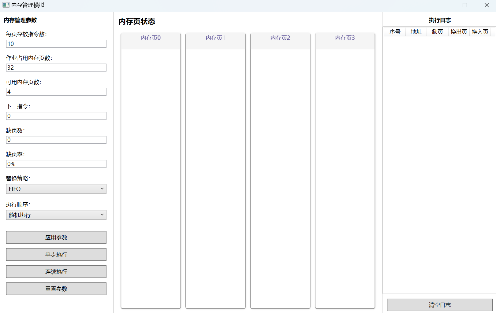

##### 6.2.2 内存页面板说明

本系统界面分为三大区域，内存页面板位于中间，负责动态展示当前内存页的状态，是用户观察内存管理运行情况的核心界面模块。

- **面板位置**
  内存页面板位于主界面中间区域，占据 Grid 的第二列，宽度自适应，支持不同屏幕大小的调整。
- **显示内容**
  面板顶部显示标题“内存页状态”，字体加粗突出。下方为内存页的可视化展示区域，使用 `UniformGrid` 组件，自动将所有内存页均匀排列为固定列数（默认4列），布局整齐美观。
- **内存页单元**
  每个内存页以一个固定大小的矩形或面板形式呈现，内部可以显示页号、状态（是否占用、是否缺页）及对应的页内指令信息，方便用户直观了解每个页面的实时情况。
- **交互与滚动**
  内存页面板包含于 `ScrollViewer` 中，当内存页数较多时可自动显示垂直滚动条，保证所有页信息均可查看。面板不允许横向滚动，保持页面布局稳定。
- **动态更新**
  页面访问、缺页、置换等操作会实时刷新内存页面板显示，用户能够直观感知调度算法效果及内存状态变化。

通过该内存页面板，用户可以清晰、直观地监控内存使用情况，辅助理解内存管理及页面置换算法的具体执行过程。

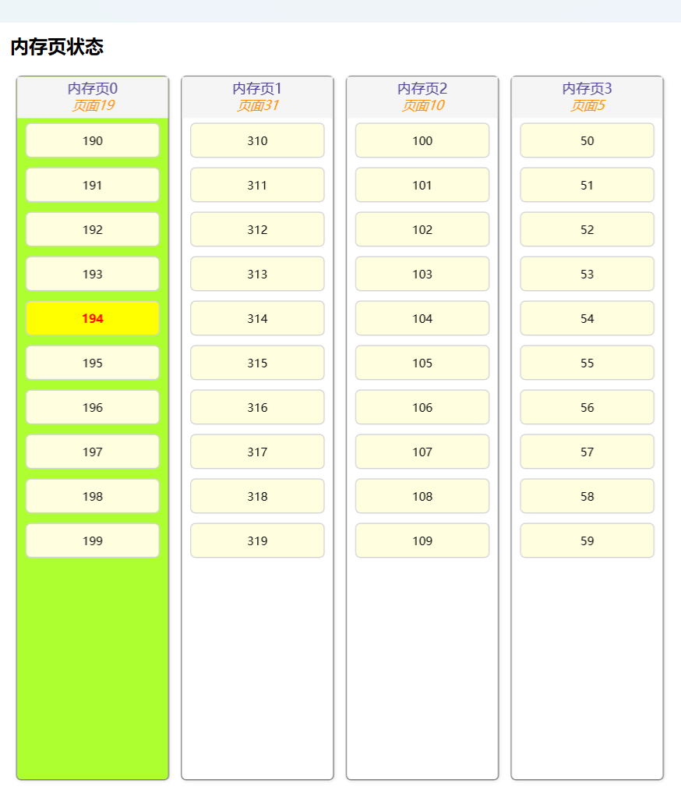

##### 6.2.3 日志面板说明

日志面板位于主界面右侧，负责动态记录和展示每次指令执行过程中发生的内存调度情况，便于用户直观查看内存管理过程中的缺页与页面置换情况。该面板包括以下三个部分：

* 标题区域

位于面板顶部，显示固定文本 **“执行日志”**，用于标识该区域的功能。

* 日志表格区域

核心日志展示区域，采用 `ListView` + `GridView` 组合实现，列表每行对应一条内存访问记录，表头包括以下列：

| 列名   | 说明                                       |
| ------ | ------------------------------------------ |
| 序号   | 当前指令的执行序号，自增记录               |
| 地址   | 当前访问的逻辑地址                         |
| 缺页   | 本次访问是否发生缺页，显示“是”或“否”       |
| 换出页 | 如果发生页面置换，被换出的页号，若无则为空 |
| 换入页 | 本次访问调入内存的页号                     |

表格采用**均分列宽**设计，所有内容居中对齐，且支持垂直滚动查看历史记录。

* 操作按钮区域

位于日志表格下方，提供一个“清空日志”按钮，点击后会清除当前所有日志记录，便于用户重新开始新的模拟过程。


##### 6.3.4 参数按钮说明

* 更换替换算法

  选择相应算法**按钮**后，点击**应用参数**

  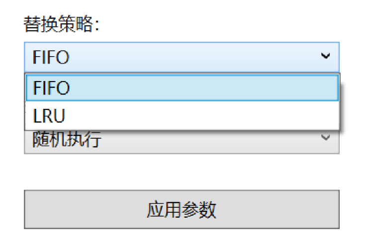


* 更换指令执行顺序

  ​    选择相应指令执行顺序**按钮**后，点击**应用参数**

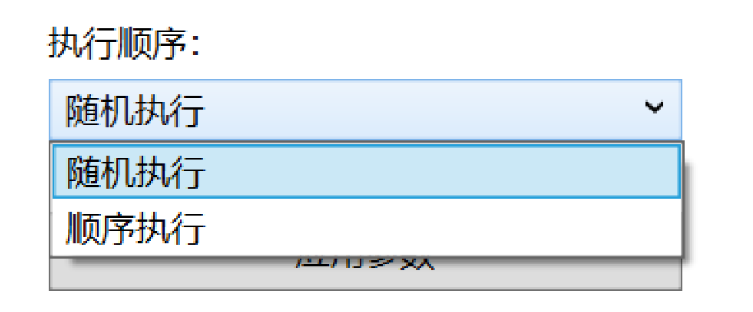

*  更换内存页状态，比如修改为5页，每页最多8条指令

   修改参数框，点击**应用参数**

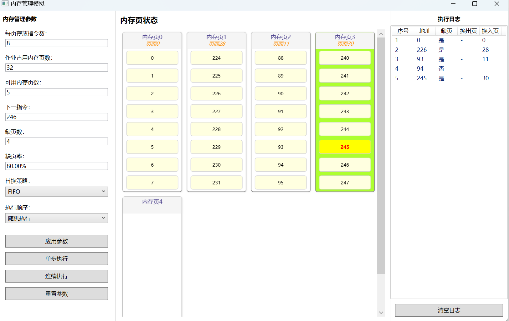

------

### 📌 七、总结与收获

通过本项目，我深入理解了操作系统内存管理机制中的**分页管理**与**页面置换算法**的运行过程。通过代码实现，不仅掌握了内存调度策略的具体执行细节，也提升了对操作系统底层资源调度逻辑的感性认识。尤其在LRU和FIFO算法实现和回调机制设计上，锻炼了C#事件委托与接口编程能力。此外，通过项目的WPF可视化界面设计，使抽象的内存管理过程直观易懂，达到了**教学可视化模拟**的目标。


## Assignment3

### 一、项目结构简介

本项目为基于 C# 的 WPF 桌面应用，采用 MVVM 架构，实现了一个简易的文件系统模拟器。系统支持目录树操作、文件增删查改、持久化存储及空间管理，并通过 WPF 前端实现友好的可视化界面交互。

---

### 二、项目结构目录

项目结构如图所示：

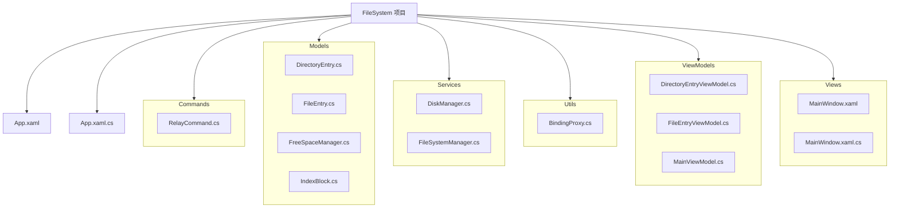


- **Commands**：命令实现（如 `RelayCommand`），用于 MVVM 命令绑定
- **Models**：核心数据结构，包括目录、文件、空间管理等
- **Services**：业务逻辑，如磁盘和文件系统管理器
- **Utils**：辅助工具（如 `BindingProxy`）
- **ViewModels**：所有 ViewModel 层，负责数据与命令逻辑
- **Views**：界面层（如 `MainWindow.xaml` 和后台代码）

---

### 三、实验原理

#### 概述

文件系统的核心任务是对文件在磁盘上的存储空间进行有效管理。主要包括三大技术要点：**文件分配方式**、**空闲空间管理方法**和**目录结构设计**。

- **分配方式**：指文件占用磁盘空间时，如何为其分配物理块。常见的分配方式有：
  1. **连续分配**：文件的所有数据块在磁盘上是连续的。优点是随机访问速度快，缺点是易产生外部碎片，扩展困难。
  2. **链接分配**：文件系统中的链接分配方式主要分为显式链接和隐式链接两类：**显式链接**指的是所有数据块之间的链接关系在磁盘的某个“专门区域”显式集中地保存。例如，FAT（File Allocation Table，文件分配表）就是显式链接的典型代表。在FAT方式中，磁盘有一张专门的分配表，表的每一项记录每个数据块的“下一个块号”。这样，系统可以直接通过查表来确定任意块的后继块，提高了随机访问的效率。优点：集中管理、随机访问更快（查表即可）。缺点：FAT表需常驻内存，表太大时不适合超大容量磁盘。**隐式链接**指的是每个数据块本身（块的尾部或头部）保存下一个数据块的指针。这样，块与块之间的关系是隐含在每个数据块自身的，类似链表。优点：结构简单，无需额外表结构。缺点：随机访问慢，需顺序遍历链表才能访问到指定块，不便于直接定位。
  3. **索引分配**：为每个文件分配专门的索引块，所有数据块的地址都记录在索引块中。优点是支持大文件、随机访问效率高，是现代文件系统常用的方法。
- **空闲空间管理**：指文件系统如何管理和分配未被占用的磁盘空间。常见方法有：
  1. **空闲块链表法**：所有空闲块通过链式指针串联，适用于分配和回收频繁的场景，但查找和维护略慢。
  2. **位图法**：用一位表示一个磁盘块的使用状态，空间利用高，但适合磁盘块数不是特别巨大的场景。
  3. **成组链接法**：将空闲块分组，每组维护部分块的指针，兼顾了链表和数组的优点，分配回收效率高，适合大容量磁盘。
- **目录结构**：文件系统为方便用户管理大量文件，采用了多种目录结构：
  1. **单级目录**：所有文件都放在同一个目录下，简单但不适合管理大量文件。
  2. **两级目录**：每个用户有一个独立的目录，提升了管理灵活性。
  3. **多级目录（树形目录）**：支持任意层级的子目录，是现代操作系统的标准做法，最大程度提高了文件管理的灵活性和可扩展性。

本项目采用**索引分配方式**，**成组链接法**，**多级目录**实现项目。

#### 1. 索引分配方式

索引分配是一种高效的文件存储分配方式。其核心思想是：为每个文件分配一个专门的索引块，索引块中存储该文件所有数据块的物理地址（编号）。  

- **优点**：支持大文件、快速随机访问、更便于管理碎片。
- **实现过程**：  
  - 创建文件时，先分配一个索引块（如本项目中的`IndexBlock`），所有数据块的编号通过指针保存在索引块中。
  - 写文件时，先计算所需数据块数，分配空闲块，将数据写入对应块，并把块号记录到索引块。
  - 读文件时，遍历索引块指针，顺序读取所有数据块内容。

在本项目中，`FileEntry`对象通过`IndexBlock`字段与磁盘块一一对应，所有数据块的分配与释放均通过该索引块完成。

#### 2. 成组链接法的空闲空间管理

成组链接是一种常见的磁盘空闲块管理方式，能高效地实现空间分配与回收。

- **主要原理**：将若干空闲块分成一组，每组通过链式指针连接，分配和回收时以组为单位进行，避免频繁扫描整个磁盘。
- **在本项目的实现**：
  - `FreeSpaceManager`负责管理所有空闲块的分配与释放。
  - 分配新数据块或索引块时，从空闲组中取出；回收时再按组方式归还。
  - 状态持久化到`freespace_state.json`，实现断点恢复。
  - 通过打印超级块和组表可直观查看空间管理状态。

这种方式提高了磁盘空间利用率，特别适合频繁分配与回收的文件系统场景。

#### 3. 多级目录结构

多级目录是现代文件系统的基础，允许用户以树形方式组织和管理大量文件。

- **原理**：
  - 每个目录可包含若干子目录和文件，形成分层结构（树形结构）。
  - 根目录为顶层，所有文件和子目录均可以通过路径唯一定位。
- **在本项目中**：
  - 用`DirectoryEntry`和`FileEntry`类分别表示目录和文件，目录对象拥有`Children`集合，递归描述所有子项。
  - `Root`为文件系统根目录，`CurrentDirectory`记录当前工作目录，支持多层嵌套和递归操作。
  - 支持递归新建、删除、重命名目录或文件，操作后自动持久化到`file_state.json`。

#### 4. 三者协同实现文件系统核心

- 当用户在界面或命令行创建/删除文件或目录时，系统先更新目录树（多级目录），再通过空闲空间管理分配/回收磁盘块（成组链接），并使用索引块记录数据块位置（索引分配）。
- 所有操作最终都能映射到对磁盘块的高效操作（分配、释放、查找），保证系统一致性和高性能。
- 项目通过 MVVM 架构，实现了前后端的解耦，所有原理均可在代码和界面中直观体验。

---

### 四、核心数据结构

本项目核心数据结构包括：**文件/目录统一抽象（FileEntry/DirectoryEntry）**、**空闲空间成组链接管理（FreeSpaceManager）**、**索引块（IndexBlock）**等。

#### 1. 文件与目录的统一抽象与多态实现

**代码片段：**

```csharp
public enum EntryType { File = 0, Directory = 1 }

public class FileEntry
{
    public string Name { get; set; }
    public EntryType Type { get; set; }
    public long Size { get; set; }
    public DateTime CreatedTime { get; set; }
    public DateTime ModifiedTime { get; set; }
    public IndexBlock IndexBlock { get; set; }
    [JsonIgnore]
    public DirectoryEntry Parent { get; set; }
    // ... 构造函数等
}

public class DirectoryEntry : FileEntry
{
    public List<FileEntry> Children { get; set; }
    public DirectoryEntry() : base() { Children = new List<FileEntry>(); Type = EntryType.Directory; }
    // ... AddChild, RemoveChild 等方法
}
```

**实现要点：**

- **继承与多态**：`DirectoryEntry`继承自`FileEntry`，通过`Type`属性区分文件和目录。这样所有文件和目录都能用统一的接口和集合（如`List<FileEntry>`）管理，实现递归树结构。
- **多态集合**：`Children`为`List<FileEntry>`，可同时存放文件和子目录，实现任意层级树结构。
- **父子关系**：每个`FileEntry`有`Parent`字段，目录树可双向遍历。
- **构造与保护**：构造函数初始化类型和子集合，防止空指针。
- **扩展性**：如需实现符号链接等新类型，仅需继承`FileEntry`。

#### 2. 目录树的序列化与反序列化

**代码片段：**

```csharp
public void SaveToFile(string filePath) {
    var settings = new JsonSerializerSettings { ... };
    string json = JsonConvert.SerializeObject(this, settings);
    File.WriteAllText(filePath, json);
}
public static DirectoryEntry LoadFromFile(string filePath) {
    string json = File.ReadAllText(filePath);
    var settings = new JsonSerializerSettings { Converters = { new FileSystemConverter() } };
    var root = JsonConvert.DeserializeObject<DirectoryEntry>(json, settings);
    RebuildParentReferences(root);
    return root;
}
```

- **序列化**：采用Json.NET将目录树对象转为JSON字符串，便于持久化存储和可视化调试。
- **自定义反序列化**：利用`FileSystemConverter`，根据`Type`字段动态实例化`DirectoryEntry`或`FileEntry`，实现多态反序列化。
- **递归恢复父指针**：`RebuildParentReferences`递归修复父子关系，解决JSON无法自动还原父节点的问题。

#### 3. 成组链接法的空闲空间管理

**代码片段：**

```csharp
public class FreeSpaceManager
{
    public int totalBlocks, groupSize, superBlockIndex;
    public Dictionary<int, List<int>> groupTable;
    // 初始化
    public void InitialFreeSpace() { ... } // 将磁盘块分组，组内用栈，组间链表
    public int AllocateBlock() { ... }     // 分配块，动态切换超级块
    public void FreeBlock(int blockNum) { ... } // 释放块，可能更换超级块
    public void SaveToFile(string filePath) { ... }
    public static FreeSpaceManager LoadFromFile(string filePath) { ... }
}
```

- **数据结构**：用`Dictionary<int, List<int>>`模拟磁盘的成组链接表，将空闲块分组管理（每组为一个管理块）。
- **分配/回收算法**：分配时先用超级块，满后切换下一组；释放时判断超级块是否可容纳，不可容纳时该块变为新超级块，完全模拟成组链接机制。
- **持久化**：用`System.Text.Json`序列化/反序列化空闲空间状态，方便实验演示和断点恢复。

#### 4. 索引块的实现

**代码片段：**

```csharp
public class IndexBlock
{
    public int BlockSize, PointerSize, MaxPointers, UsedCount;
    private int[] DataBlockPointers;
    public int indexBlockId { get; private set; }
    public IndexBlock(int blockSize, int pointerSize, int id) { ... }
    public bool AddPointer(int blockNumber) { ... }
    public bool RemovePointer(int blockNumber) { ... }
    public int GetPointer(int index) { ... }
    // ...
}
```

- **封装**：所有指针和内部状态均封装为私有/只读属性，通过方法维护一致性。
- **算法**：支持动态分配/回收数据块指针，判断是否已满，支持随机访问和清空指针。
- **设计亮点**：每个文件独立拥有一个索引块，支持高效随机存取，结构与Unix文件系统极为相似。

#### 5. 多态与自定义序列化器

**代码片段：**

```csharp
public class FileSystemConverter : JsonConverter
{
    public override bool CanConvert(Type objectType) => objectType == typeof(FileEntry);
    public override object ReadJson(JsonReader reader, Type objectType, object existingValue, JsonSerializer serializer)
    {
        JObject jo = JObject.Load(reader);
        var type = (EntryType)jo["Type"].Value<int>();
        FileEntry entry = type == EntryType.Directory ? new DirectoryEntry() : new FileEntry();
        serializer.Populate(jo.CreateReader(), entry);
        return entry;
    }
    // ...
}
```

- **实现要点**：根据JSON中的`Type`字段，动态实例化具体类型对象，解决多态反序列化问题。
- **优势**：支持任意层级、任意类型组合的文件系统树结构持久化与还原。

---

#### 五、核心服务类 FileSystemManager

`FileSystemManager` 是核心服务类，实现了文件系统的主要操作和状态维护，关键属性和方法如下：

- **属性说明**：
  - `Root`：根目录对象（`DirectoryEntry` 类型）
  - `CurrentDirectory`：当前工作目录
  - `diskManager`：虚拟磁盘块管理
  - `spaceManager`：空闲空间的分配与回收
  - 配置参数如块大小、指针大小、总块数等

- **主要功能**：
  - 目录和文件的创建、重命名、删除（支持递归删除目录）
  - 文件内容的写入和读取（分块存储，支持大文件写入）
  - 文件空间分配与回收，持久化存储状态到 json 文件
  - 支持命令行模式操作及持久化
  - 提供当前目录下所有文件/文件夹的信息获取

- **持久化设计**：
  - `freespace_state.json`：记录空间分配状态
  - `file_state.json`：记录目录和文件结构
  - 启动时自动加载，未找到则初始化

- **示例代码结构**：

```csharp
public class FileSystemManager
{
    // ... 属性定义
    public FileSystemManager() { ... }
    public DirectoryEntry CreateDirectory(string name) { ... }
    public void DeleteDirectory(string name) { ... }
    public FileEntry CreateFile(string name) { ... }
    public void WriteFile(FileEntry fileEntry, byte[] data) { ... }
    public void DeleteFile(string name, DirectoryEntry dir) { ... }
    public string ReadFile(DirectoryEntry dir, string name, DiskManager disk) { ... }
    public void RenameEntry(string oldName, string newName) { ... }
    public List<EntryInfo> GetCurrentDirectoryInfos() { ... }
    // 其他命令行与测试辅助函数
}
```

---

#### 六、MVVM 架构说明

- **Model**：负责数据结构（如文件、目录、索引块、空闲块管理）
- **ViewModel**：如 `MainViewModel`，负责命令与数据绑定，处理所有与界面相关的业务逻辑
- **View**：XAML 文件，负责数据展示与用户交互
- **命令实现**：如 `RelayCommand`，配合 ViewModel，响应界面操作


- `Models/DirectoryEntry.cs`、`FileEntry.cs`：目录与文件结构定义
- `Models/FreeSpaceManager.cs`、`IndexBlock.cs`：磁盘空间与索引块管理
- `Services/FileSystemManager.cs`：文件系统核心服务
- `Services/DiskManager.cs`：虚拟磁盘块读写
- `ViewModels/MainViewModel.cs`：主界面数据和命令绑定
- `Views/MainWindow.xaml`：主界面布局
- `Commands/RelayCommand.cs`：命令封装类
- `Utils/BindingProxy.cs`：辅助数据绑定

---

#### 七、测试与展示

1. **新建目录/文件**

   - 右键点击

   

   

   - 或者通过按钮创建

   

   

   - 创建结果展示

   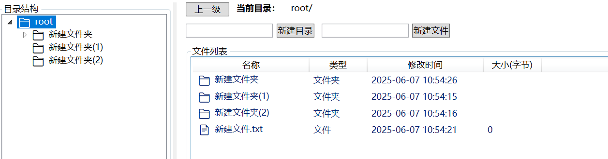

   2.**目录层级关系**

   - 左侧目录树

   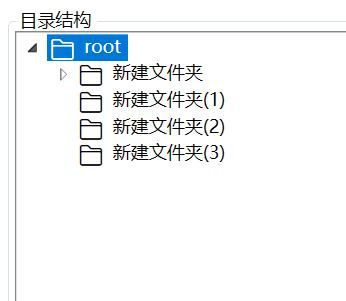

   - 点击左侧栏目录进行切换

   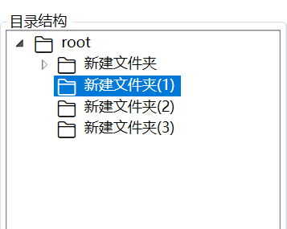

   - 双击右侧文件夹也可进行切换

   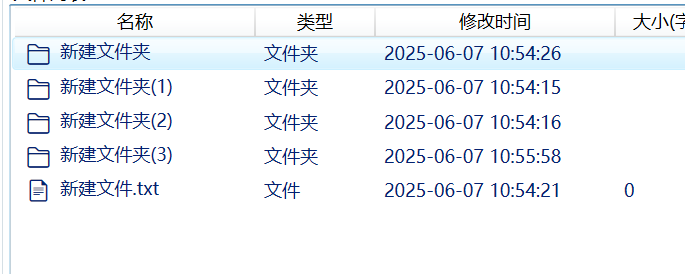

   - 文件夹路径显示

   

    

3.**文件或文件夹删除**


4.**文件或文件夹重命名**


5.**文件读取和保存**

   双击文件可以打开读取并编辑文件

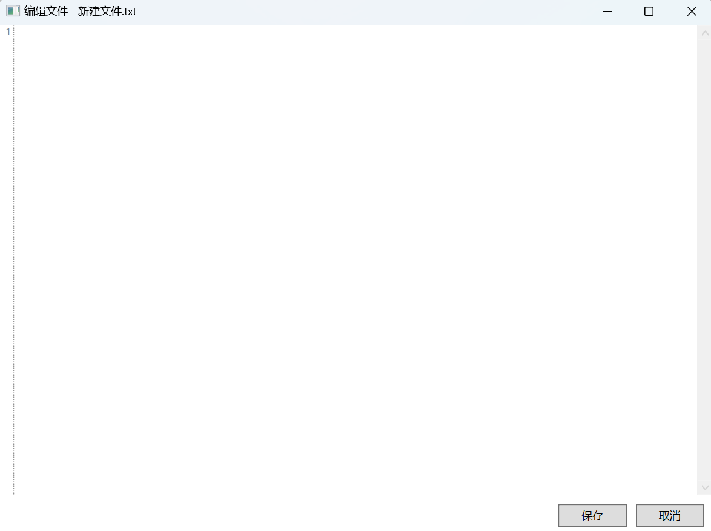

编辑结束可以实现保存

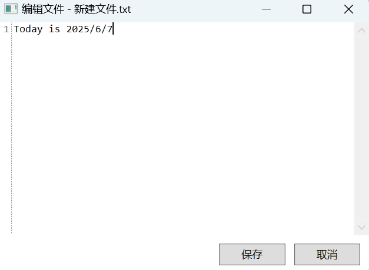


---

### 八、调试和模拟

本项目在 Service 层的 `FileSystemManager` 类中，专门实现了控制台交互版本的命令行虚拟文件系统。  
用户只需实例化 `FileSystemManager` 并调用其 `RunCommandLine()` 方法，即可进入命令行交互界面。该模式下实现的文件系统操作与图形界面版功能完全一致。

这种设计既方便了前期的算法调试、数据结构验证，也便于后期的自动化测试和批量操作。通过控制台命令，开发者能够模拟文件的创建、删除、目录切换、内容读写、空间分配等一系列核心功能，从而高效地验证系统的正确性和健壮性。

使用方法如下:

> ```c#
> FileSystemManager fileSystemManager = new FileSystemManager();
> fileSystemManager.RunCommandLine();
> ```

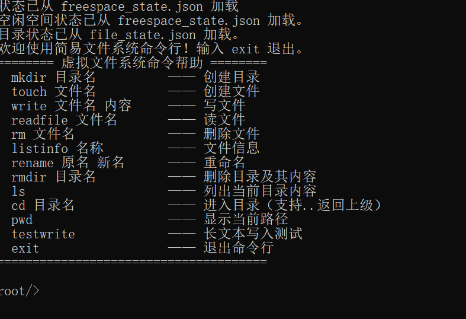

命令行模式支持所有常用文件和目录操作，并通过丰富的日志输出，帮助开发者高效观察和分析系统内部状态与行为，提升测试与维护效率。

在下面演示中设置磁盘**20块**，每块**4KB**。

* 基本功能演示

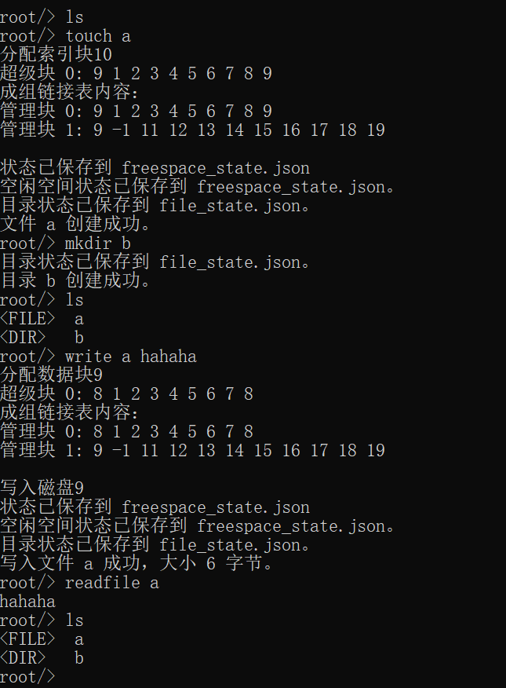

* 分配回收测试

  ①此时磁盘的20个块均未别分配

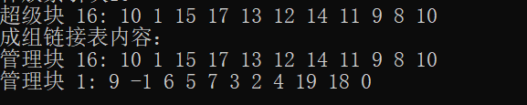

  ②不断新建文件夹和文件，进行写入

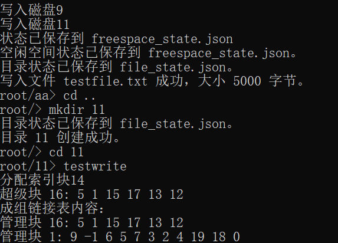

直到磁盘空间不足

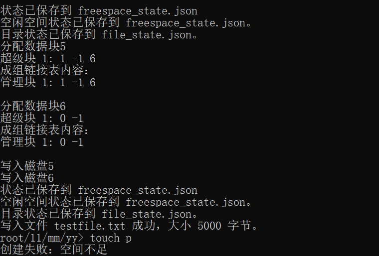

进行文件删除

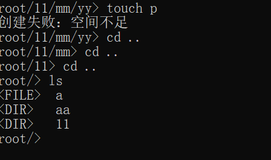

删除所有文件和文件夹后，发现磁盘块全部被回收成功

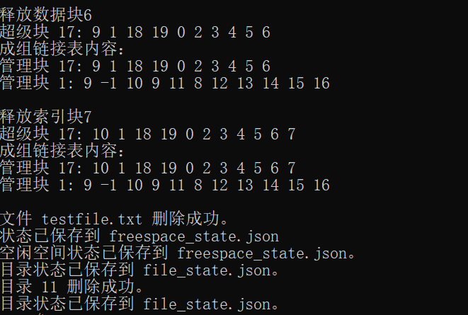

---

### 九、如何运行与测试

1. 用 Visual Studio 打开项目，恢复依赖并编译
2. 直接运行Release即可，支持图形界面操作
3. 可在Visual Studio调用命令行函数测试大文件写入、递归删除等功能


---

### 十、联系方式

如有问题或建议，请联系作者：<3056399771@qq.com>
